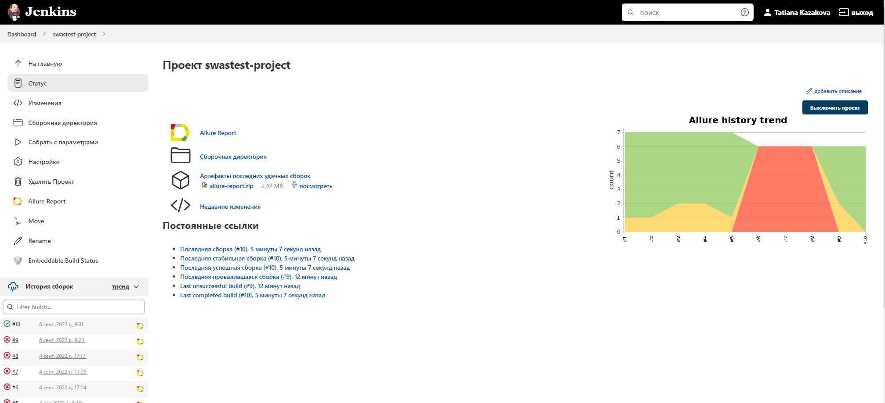
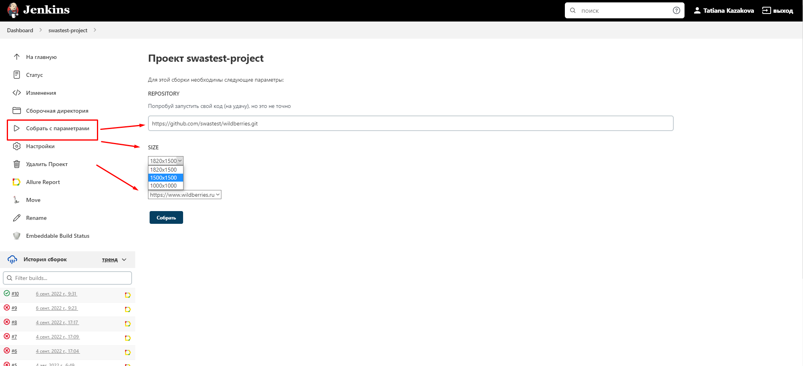
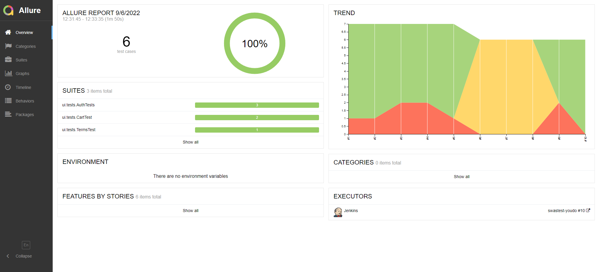
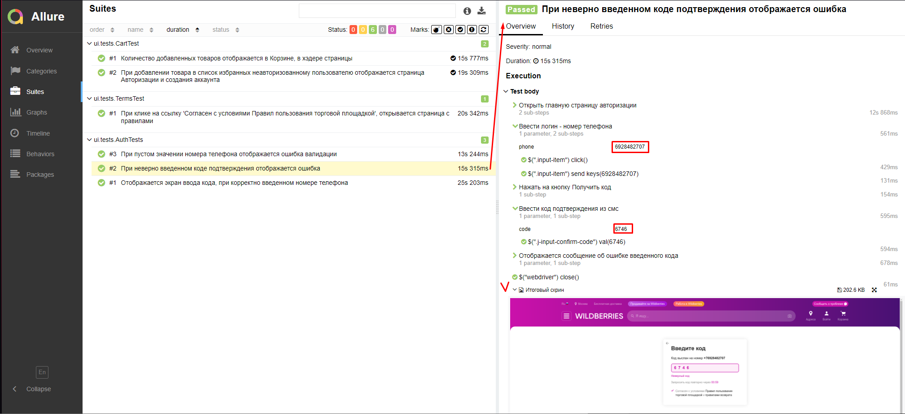
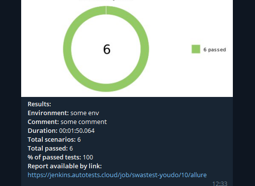
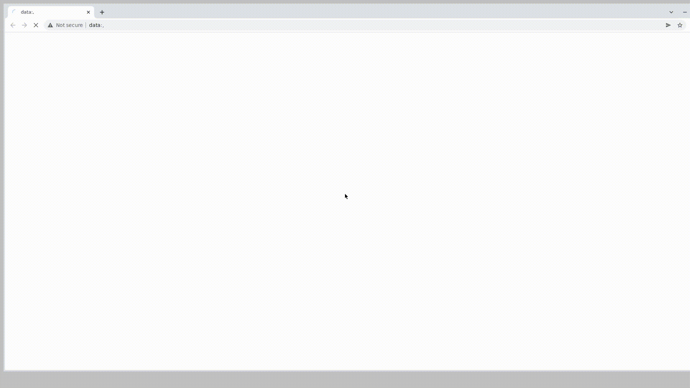

# Проект по автоматизации тестирования веб-приложения Wildberries
## <a target="_blank" href="https://www.wildberries.ru/">Wildberries - Интернет-магазин модной одежды и обуви!</a>
<p align="center">

</p>


## :floppy_disk: Содержание:

- <a href="#computer-технологии-и-инструменты">Технологии и инструменты</a>
- <a href="#notebook_with_decorative_cover-реализованные-проверки">Реализованные проверки</a>
- <a href="#electric_plug-сборка-в-Jenkins">Сборка в Jenkins</a>
- <a href="#arrow_forward-запуск-из-терминала">Запуск из терминала</a>
- <a href="#open_book-allure-отчет">Allure отчет</a>
- <a href="#robot-отчет-в-telegram">Отчет в Telegram</a>
- <a href="#film_projector-видео-примеры-прохождения-тестов">Видео примеры прохождения тестов</a>

***

## :computer: Технологии и инструменты
<p align="center">


</p>

***

## :notebook_with_decorative_cover: Реализованные проверки
- При авторизации с пустым значением в поле номера телефона - отображается ошибка валидации
- Отображается экран ввода кода подтверждения, при авторизации с валидным номером телефона
- При неверно введенном коде подтверждения - отображается ошибка, авторизация является неудачной
- При добавлении товара в список избранных неавторизованному пользователю отображается страница Авторизации и создания аккаунта
- Количество добавленных товаров отображается в Корзине, в хэдере страницы
- При клике на ссылку 'Согласен с условиями Правил пользования торговой площадкой', открывается страница с правилами

***

## :electric_plug: Сборка в Jenkins
### <a target="_blank" href="https://jenkins.autotests.cloud/job/swastest-project/">Сборка в Jenkins</a>
<p align="center">

</p>  

***

## :arrow_forward: Запуск из терминала
Локальный запуск:
```
gradle clean test -Dhost=local 
```
## :gear: Запуск тестов с выбором параметров


Удаленный запуск:
```
clean
test
-Dhost=remote
-DbrowserName=${BROWSERNAME}
-DbrowserVersion=${VERSION}
-DenvUrl=${ENV_URL}
-DbrowserSize=${BROWSERSIZE}
```


***

## :open_book: Allure отчет
- ### Главный экран отчета
<p align="center">

</p>

- ### Страница с проведенными тестами
*Можно подробно разобрать каждый шаг тест кейса, сбоку отображаются все шаги и тестовые данные*
<p align="center">

</p>

***

## :robot: Отчет в Telegram
<p align="center">

</p>

***
## :film_projector: Видео примеры прохождения тестов
> К каждому тесту в отчете прилагается видео. Одно из таких видео представлено ниже.
<p align="center">
  
</p>

